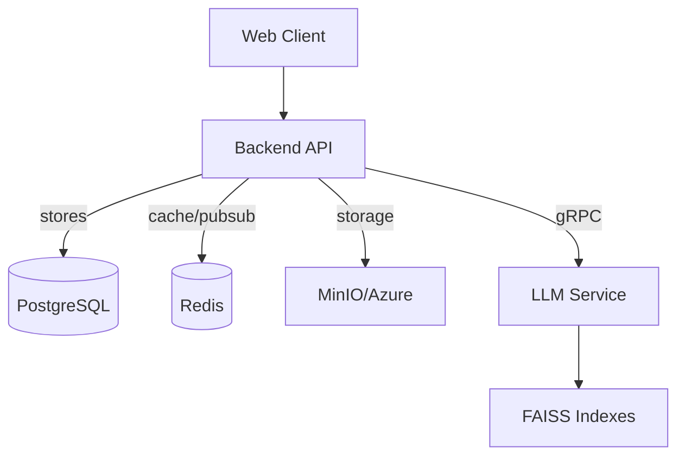

# Cloud Drive (Monorepo)

Simple, opinionated cloud drive service with file uploads, sharing, search, and AI-powered document summarization/chat.

This repository contains three main folders:

- `backend/` — Go API (REST + GraphQL) with PostgreSQL, Redis, MinIO/Azure integration.
- `frontend/` — React + TypeScript + Vite single-page app.
- `llm/` — Python gRPC service for summarization and document Q&A (FAISS + HuggingFace + Ollama).

## Quick start (local, dev)

1. Start infra containers (Postgres, Redis, MinIO, Kafka optional):

```bash
cd backend
docker compose up -d
```

2. Configure env files

```bash
cp backend/.env.example backend/.env
cp frontend/.env.example frontend/.env
cp llm/.env.example llm/.env
# Edit values as needed (DB, Redis, STORAGE_PROVIDER, LLM token)
```

3. Run migrations and start backend

```bash
cd backend
make migrateUp
make watch   # or: air
```

4. Start frontend

```bash
cd frontend
npm i
npm dev
```

5. (Optional) Start LLM service

```bash
cd llm
docker compose up -d   # starts Ollama runtime
python -m venv venv
source venv/bin/activate   # Windows: venv\Scripts\activate
pip install -r requirements.txt
python server.py
```

## Architecture (high-level)



## Where to look

- `backend/README.md` — Backend details: tech, ports, migrations, run instructions
- `frontend/README.md` — Frontend details: tech, scripts, env
- `llm/README.md` — LLM gRPC service: API methods, ports, env

## Service ports (defaults)

- Backend API: `http://localhost:8080`
- PostgreSQL: `5432`
- Redis: `6379`
- MinIO: `9000` (API), `9001` (console)
- LLM gRPC: `50051`

## Notes

- Use `.env.example` files in each folder as templates.
- The LLM service expects a bearer token in gRPC metadata; set `LLM_GRPC_TOKEN` in both backend and LLM `.env` files.
