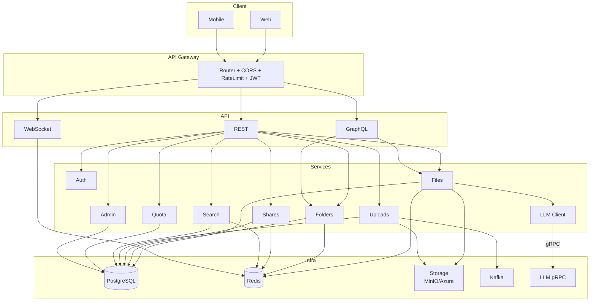

# 🚀 Cloud Drive Backend

High-performance file management API with AI summarization, real-time updates, and multi-cloud storage.

## 🛠️ Tech Stack

### Core Framework

- **Go 1.25+** - High-performance backend runtime
- **Gin** - HTTP web framework with middleware support
- **gqlgen** - Type-safe GraphQL server generator
- **Zap** - Structured logging

### Data & Storage

- **PostgreSQL** - Primary database with full-text search (tsvector, pg_trgm)
- **Redis** - Caching, rate limiting, and pub/sub for WebSocket notifications
- **MinIO** - Object storage (multi-cloud S3 provider support)

### External Services

- **Kafka** - Event streaming for async file processing
- **Python gRPC LLM** - Document summarization and Q&A
- **SMTP** - Email notifications (password reset, verification)

### DevOps

- **Docker Compose** - Local development environment
- **Air** - Live reload for Go development
- **Swagger/OpenAPI** - Auto-generated API documentation

## 🏗️ Architecture



## 📊 Database (from migrations)

- **users**: accounts, quota, admin flag, email verification
- **refresh_tokens**: hashed refresh tokens with device/ip and expiry
- **file_contents**: deduplicated blobs (content_hash, ref_count)
- **user_files**: metadata, folder, tags JSONB, version_of, soft delete, FTS
- **upload_sessions**: chunked upload state
- **folders**: hierarchical tree (parent_id), soft delete
- **shares**: token links (file/folder), recursive/snapshot modes
- **share_users**: per-user permissions
- **audit_logs**: admin actions ledger

## 🔌 Service Ports

Based on `docker-compose.yml`:

- **PostgreSQL**: `5432` (configurable via `DB_PORT`)
- **Redis**: `6379`
- **MinIO API**: `9000`
- **MinIO Console**: `9001`
- **Kafka (internal)**: `9092`
- **Kafka (external)**: `29092`
- **Zookeeper**: `2181`
- **Schema Registry**: `8085`
- **Kafka UI**: `8086`

Standalone:

- **LLM gRPC**: `50051` (see `llm/README.md`)

## ⚙️ Setup

1. **Configure environment**

   ```bash
   cd backend
   cp .env.example .env
   # Update credentials (DB, Redis, Storage, SMTP, LLM)
   ```

2. **Start services (Docker Compose)**

   ```bash
   docker compose up -d
   ```

3. **Migrate database**

   ```bash
   make migrateUp
   ```

4. **Run API**

   ```bash
   # Development (live reload)
   make watch
   # or
   air

   # Production
   make build
   ./main.exe
   ```

**Default server**: `http://localhost:8080`

**LLM (optional)**: Run Python server in `llm/` (gRPC at `127.0.0.1:50051`).

See also: `llm/README.md` for LLM service details.

## 🔗 API Quick Links

- **Swagger UI**: http://localhost:8080/swagger/index.html
- **GraphQL Playground**: `POST /api/v1/graphql`
- **WebSocket**: `GET /api/v1/ws/downloads`

**Auth header** for protected routes:

```
Authorization: Bearer <access_token>
```

## 📝 Notes

- Storage provider via `STORAGE_PROVIDER=minio|azure`
- Timeouts and gRPC message limits tuned for large PDFs
- Search uses weighted tsvector (filename A + tags B) and trigram index
- Deduplication via `file_contents.ref_count`; soft-deletes via `deleted_at`
- `JWT_SECRET` - Secret for signing JWTs
- `DB_HOST`, `DB_PORT`, `DB_DATABASE`, `DB_USERNAME`, `DB_PASSWORD` - PostgreSQL connection
- `REDIS_ADDR`, `REDIS_PASSWORD` - Redis connection
- `MINIO_ENDPOINT`, `MINIO_ACCESS_KEY`, `MINIO_SECRET_KEY`, `MINIO_BUCKET` - MinIO storage
- `AZURE_STORAGE_ACCOUNT`, `AZURE_STORAGE_KEY`, `AZURE_BLOB_CONTAINER` - Azure Blob (alternative)
- `STORAGE_PROVIDER` - `minio` or `azure`
- `LLM_GRPC_ADDR`, `LLM_GRPC_TOKEN` - LLM service connection
- `SMTP_HOST`, `SMTP_PORT`, `SMTP_USER`, `SMTP_PASSWORD` - Email configuration

## Development

### Generate Swagger Docs

```bash
swag init -g cmd/api/main.go -o docs
```

### Project Structure

```
backend/
├── cmd/
│   ├── api/main.go          # HTTP server entry point
│   └── gcworker/main.go     # Kafka consumer (garbage collection)
├── internal/
│   ├── api/
│   │   ├── rest/            # REST handlers
│   │   └── graphql/         # GraphQL resolvers + schema
│   ├── auth/                # JWT middleware, email verification
│   ├── files/               # File service layer
│   ├── folders/             # Folder service layer
│   ├── share/               # Sharing service
│   ├── uploads/             # Chunked upload handling
│   ├── admin/               # Admin operations
│   ├── quota/               # Quota management
│   ├── search/              # Full-text search
│   ├── llmclient/           # gRPC client for LLM service
│   ├── storage/             # MinIO/Azure abstraction
│   ├── cache/               # Redis caching layer
│   ├── notifications/       # WebSocket hub + Redis pub/sub
│   ├── ratelimiter/         # Rate limiting middleware
│   ├── worker/              # Kafka producer/consumer
│   └── database/            # DB connection pooling
├── migrations/              # SQL migration files
├── docs/                    # Swagger/OpenAPI specs
└── pkg/                     # Shared utilities (logger, errors)
```

## Key Features

✅ **Deduplication**: Files with identical SHA-256 hashes share a single blob (`file_contents.ref_count`)  
✅ **Versioning**: Link new file to `version_of` for version history  
✅ **Soft Delete**: `deleted_at` timestamp enables trash/restore workflows  
✅ **Full-Text Search**: Weighted search on filename (A) + tags (B) with trigram partial matching  
✅ **Rate Limiting**: Per-IP Redis-backed throttling (20 req/sec default)  
✅ **Real-Time Notifications**: WebSocket broadcasts for download count updates via Redis pub/sub  
✅ **AI Summarization**: Auto-generates document summaries on first download  
✅ **Document Q&A**: Chat with your documents using LLM-powered RAG  
✅ **Multi-Cloud Storage**: Swap between MinIO (local) and Azure Blob (production)  
✅ **Admin Audit Trail**: All admin actions logged to `audit_logs`  
✅ **Folder Sharing**: Recursive sharing with snapshot mode
